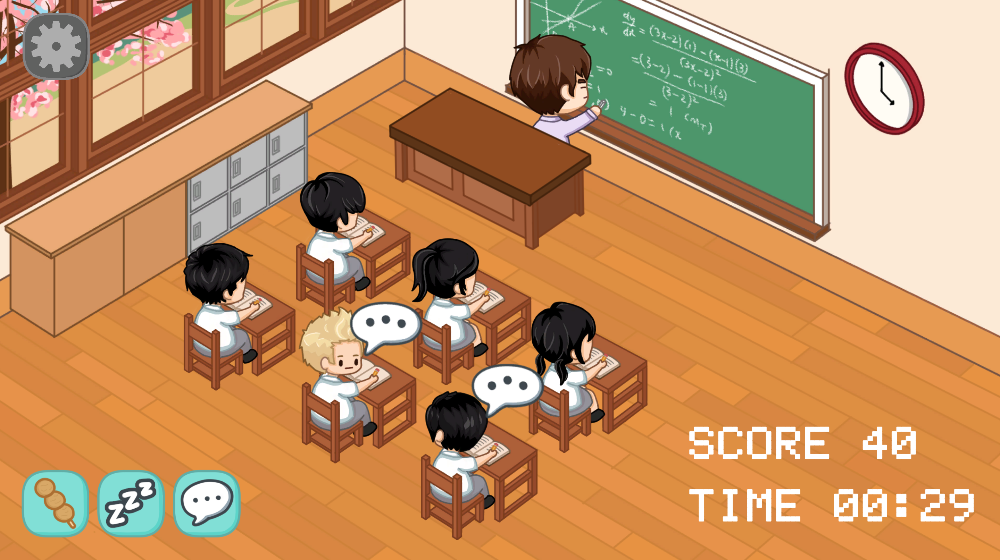
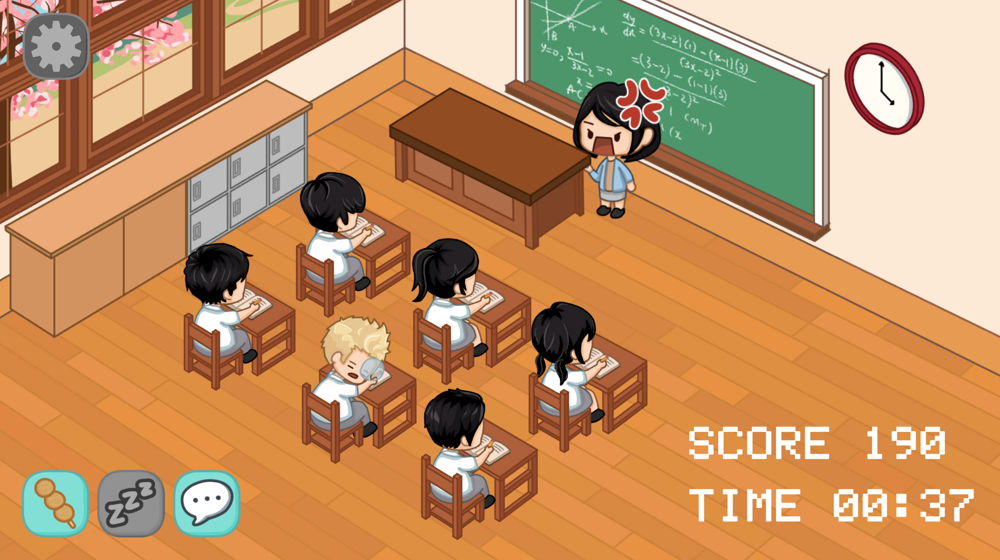

# Catch-Me-If-You-Can
## Overview
***Catch Me If You Can*** is a 2.5D action game developed with Unity and C#. The game is about a rebellious student who tries to avoid getting caught by the teacher while acting up in class.

In this game, you will play as this student and attempt different actions while the teacher is facing the blackboard, with the ultimate goal of passing all the levels and obtaining the highest possible score. Read the instructions in the main menu to learn more about the game!


## Demo Pics
 

## Installation Guide
### 1. Clone this repository
Execute the following command in a local directory:
</br>
``` git clone https://github.com/johnmak0913/Catch-Me-If-You-Can.git ```.
### 2. Start the game
#### Windows Version:
Open ``` 3329GroupProject.exe ``` in the ``` Game-Windows ``` directory.

#### MacOS Version:
Open ``` 3329GroupProject ``` in the ``` Game-MacOS/CatchMeIfYouCan.app/Contents/MacOS ``` directory.

#### Have fun~~
